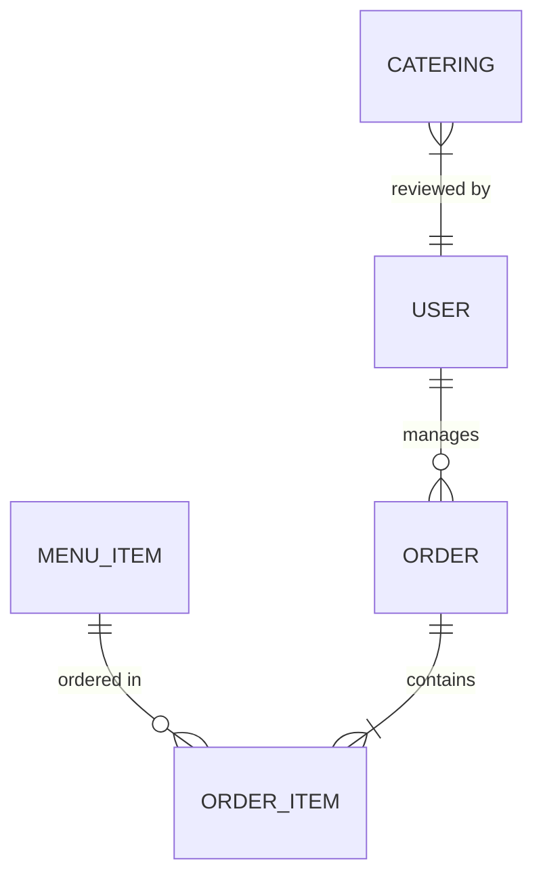

# Database Schema Specification

Dokumen ini merinci skema database secara teknis untuk keperluan pengembangan dan integrasi.

## Entity Relationship Summary

## Table Definitions

### 1. `menu_items`
Menyimpan katalog menu makanan dan minuman.

| Column | Type | Nullable | Default | Description |
| :--- | :--- | :--- | :--- | :--- |
| `id` | bigint (PK) | No | | Auto Increment |
| `name` | string | No | | Nama menu unik |
| `description` | text | No | | Deskripsi produk |
| `price` | integer | No | | Harga dalam Rupiah |
| `category` | enum | No | | Kategori menu |
| `image_url` | string | No | | Path ke file gambar |
| `available` | boolean | No | true | Status stok |
| `is_best_seller`| boolean | No | false | Tag populer |
| `is_recommended`| boolean | No | false | Tag rekomendasi |

### 2. `orders`
Header transaksi pemesanan reguler.

| Column | Type | Nullable | Default | Description |
| :--- | :--- | :--- | :--- | :--- |
| `id` | bigint (PK) | No | | Auto Increment |
| `customer_name`| string | No | | Nama pemesan |
| `phone` | string | No | | Nomor WhatsApp |
| `total` | integer | No | 0 | Total harga pesanan |
| `status` | enum | No | pending | pending, diproses, selesai |
| `note` | text | Yes | | Catatan tambahan / Alamat |

### 3. `order_items`
Detail item dalam satu pesanan (Line Items).

| Column | Type | Nullable | Default | Description |
| :--- | :--- | :--- | :--- | :--- |
| `id` | bigint (PK) | No | | Auto Increment |
| `order_id` | bigint (FK) | No | | Relasi ke `orders.id` |
| `menu_item_id` | bigint (FK) | No | | Relasi ke `menu_items.id` |
| `name` | string | No | | Snapshot nama saat dipesan |
| `price` | integer | No | | Snapshot harga saat dipesan |
| `qty` | integer | No | 1 | Jumlah item |

### 4. `caterings`
Manajemen pesanan porsi besar (Catering).

| Column | Type | Nullable | Default | Description |
| :--- | :--- | :--- | :--- | :--- |
| `id` | bigint (PK) | No | | Auto Increment |
| `customer_name`| string | No | | Nama pelanggan |
| `phone` | string | No | | Nomor WhatsApp |
| `people` | integer | No | | Jumlah porsi yang dipesan |
| `date` | date | No | | Tanggal pengantaran |
| `time` | string | No | | Jam pengantaran |
| `status` | enum | No | pending | pending, dikonfirmasi |

## Database Best Practices
- **Soft Deletes**: (TBD) Akan diimplementasikan pada fase audit.
- **Indexing**: Indeks ditambahkan pada kolom `phone` dan `date` untuk mempercepat pencarian status pesanan.
