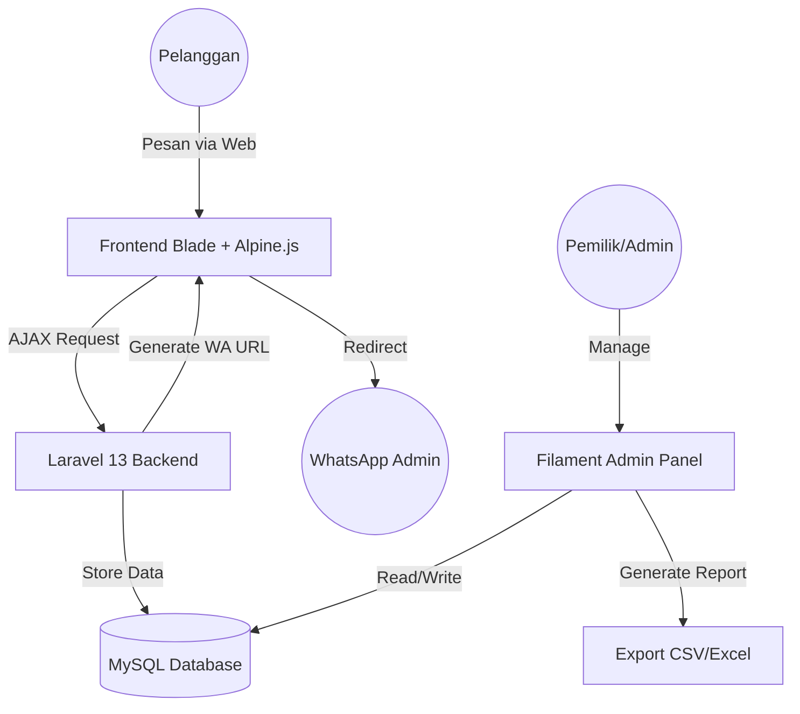

# System Design & Architecture

Dokumen ini menjelaskan arsitektur tingkat tinggi dari aplikasi De Roemah Makan.

## Overview Arsitektur

Aplikasi ini menggunakan pola **Monolith modern** dengan Laravel sebagai backend dan frontend (Blade), yang dibungkus dalam lingkungan **Docker** untuk konsistensi di berbagai perangkat.

### Flow Diagram

## Komponen Utama

### 1. Backend (Laravel 13)
Backend menangani seluruh logika bisnis, validasi, dan persistensi data. Menggunakan fitur terbaru PHP 8.4 seperti *Property Hooks* dan *Asymmetric Visibility* jika memungkinkan.

### 2. Database (MySQL 8)
Penyimpanan data relasional. Database diisolasi di dalam container Docker untuk keamanan dan kemudahan backup.

### 3. Filament Admin (The Engine)
Panel admin menggunakan Filament v5 yang menawarkan performa lebih cepat dengan sistem *Unified Schema*. Seluruh resource (Menu, Order, Catering) dikelola di sini.

### 4. Docker Environment
Lingkungan pengembangan diisolasi menggunakan `docker-compose.yml`:
- **App Service**: Menjalankan PHP-FPM dan Artisan Serve.
- **DB Service**: Menjalankan MySQL server.
- **Networks**: Menggunakan bridge network internal agar App bisa berkomunikasi dengan DB menggunakan hostname `db`.

## Alur Data (Data Flow)

1. **Pemesanan**: Data keranjang disimpan di `Session` (Server-side) untuk keamanan.
2. **Checkout**: Saat tombol diklik, data dipindahkan dari `Session` ke tabel `orders` dan `order_items`.
3. **Catering**: Data disimpan langsung ke tabel `caterings` dengan validasi tanggal di sisi server.
